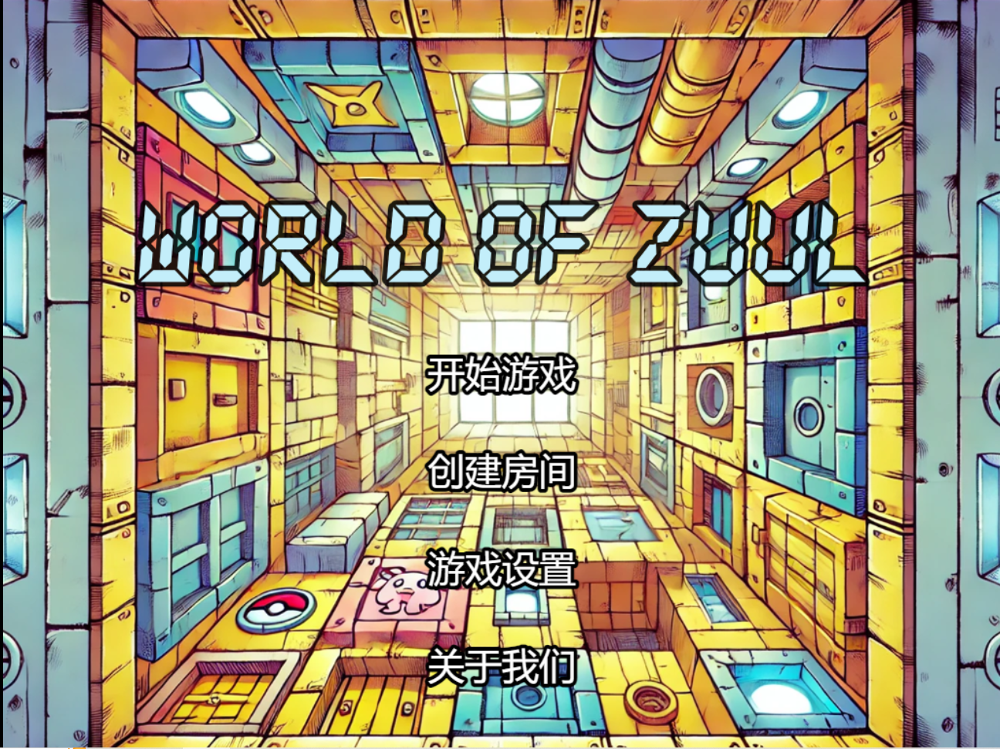
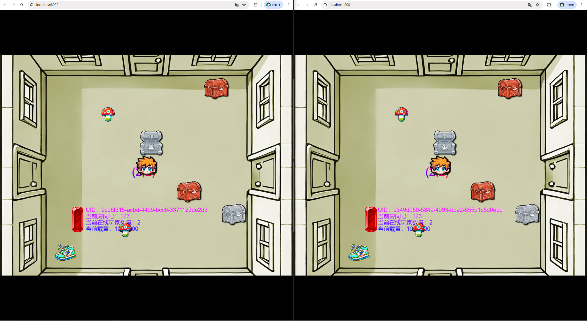

# World-of-Zuul

客户端基于UE5，网页端基于Phaser3，后端基于SpringBoot

## 项目完成情况 🥳🎉

1. 扩展游戏，使得一个房间里可以存放任意数量的物件，每个物件可以有一个描述和一个重量值，玩家进入一个房间后，可以通过`look`命令查看当前房间的信息以及房间内的所有物品信息；
2. 在游戏中实现一个`back`命令，玩家输入该命令后会把玩家带回上一个房间；
3. 在游戏中实现一个更高级的`back`命令，重复使用它就可以逐层回退几个房间，直到把玩家带回到游戏的起点；
4. 在游戏中增加具有传输功能的房间，每当玩家进入这个房间，就会被随机地传输到另一个房间；
5. 在游戏中新建一个独立的**Player**类用来表示玩家，并实现下列功能需求：
    - 一个玩家对象应该保存玩家的姓名等基本信息，也应该保存玩家当前所在的房间；
    - 玩家可以随身携带任意数量的物件，但随身物品的总重量不能操过某个上限值；
    - 在游戏中增加两个新的命令`take`和`drop`，使得玩家可以拾取房间内的指定物品或丢弃身上携带的某件或全部物品，当拾取新的物件时超过了玩家可携带的重量上限，系统应给出提示；
    - 在游戏中增加一个新的命令`items`, 可以打印出当前房间内所有的物件及总重量，以及玩家随身携带的所有物件及总重量；
    - 在某个或某些房间中随机增加一个**magic cookie**（魔法饼干）物件，并增加一个`eat cookie`命令，如果玩家找到并吃掉魔法饼干，就可以增长玩家的负重能力；
6. 扩充游戏基本架构，使其支持网络多人游戏模式，具备玩家登陆等功能；
7. 为单机或网络版游戏增加图形化用户界面，用过可以通过图形化界面执行游戏功能；
8. 可以为游戏增加数据库功能，用于保存游戏状态和用户设置；
9. 新增网页端，满足跨平台的需求
10. 新增多个物品，均有不同的功能
